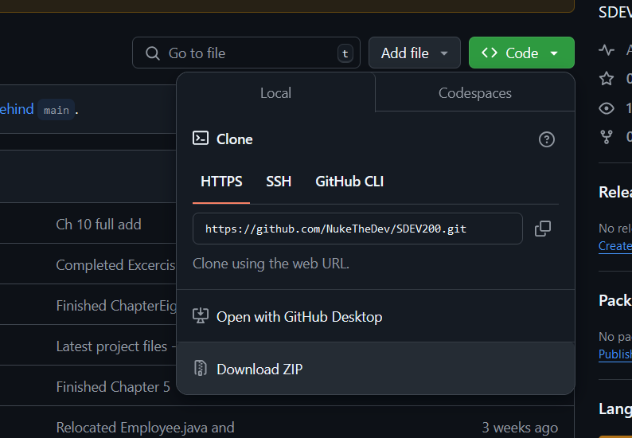
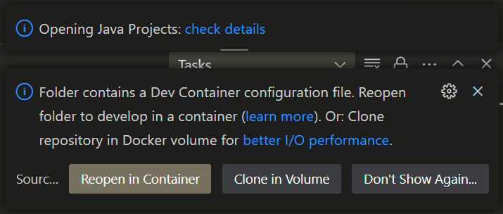

**User Guide: How to Run the If You Dare Game**

This guide provides step-by-step instructions on how to set up and run the *If You Dare* game in your local development environment using Docker and Visual Studio Code (VS Code).

**Requirements:**

1.  **Install Docker**
    -   Visit the Docker website to download Docker Desktop: [Docker Installation Guide](https://docs.docker.com/desktop/install/windows-install/).
    -   Install Docker Desktop and sign up with your email.
    -   Verify your account by confirming the code sent to your email if needed.
    -   After installation, open Docker by clicking the shortcut created on your desktop (if selected during installation).

**Step-by-Step Setup:**

1.  **Download the Game Files**
    -   First, click the green code button at the top right of your screen.
    -   Then, download the If_You_Dare_Game_v12.zip file from GitHub.
    -   **See figure 1.**

        

    -   Once finished downloading, extract the contents of the zip file to your local directory, such as C:\\Users\\Documents\\.
2.  **Open the Game Folder in VS Code**
    -   Open **Visual Studio Code (VS Code)**.
    -   Click on **File** \> **Open Folder**.
    -   Navigate to and select the C:\\Users\\Documents\\SDEV200 folder. **Do not open any subfolders within SDEV200**. *Note:* It critical to select the SDEV200 folder because it contains the essential. “.devcontainer” folder.

**Important Files:**

-   The .devcontainer folder contains two key files:
    -   devcontainer.json
    -   Dockerfile  
        These files are vital for configuring the development environment using Docker.

**Running the App in VS Code:**

1.  **Dev Container Setup**  
    After opening the SDEV200 folder, VS Code will detect the devcontainer configuration.
    -   You will see a popup message saying something like: **"Dev container configuration found! Would you like to reopen in devcontainer?"**
    -   **See figure 2.**

        

    -   Click **Yes** to reopen the project inside the devcontainer environment.
2.  **Running the Game**
    -   In the **File Explorer pane** (located on the far left in VS Code), find and click on GameSetup.java to open the file.
    -   At the top right corner of the VS Code window, you will see a play button that looks like \|\>.
    -   Click the play button to run the app.
    -   **Voila!** The *If You Dare* game should now launch.

**Troubleshooting:**

-   If you encounter any issues running Docker or opening the folder in VS Code, ensure that Docker is running correctly and that the correct folder (SDEV200) is selected in VS Code.
-   If prompted to install any extensions or dependencies in VS Code, follow the prompts to complete the setup.

Enjoy playing *If You Dare*!
